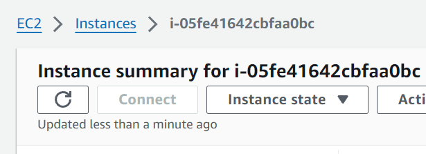

-   [Markdown, Git and APIs](#markdown-git-and-apis)
    -   [Markdown basics](#markdown-basics)
        -   [Highlighting text](#highlighting-text)
        -   [Lists](#lists)
    -   [Git](#git)
        -   [Centralised vs Distributed VCS](#centralised-vs-distributed-vcs)
        -   [Three Stages of Git](#three-stages-of-git)
        -   [Common Workflow Commands](#common-workflow-commands)
        -   [Branching](#branching)
    -   [Difference Between Git and GitHub](#difference-between-git-and-github)
        -   [Syncing Local and Remote Repositories](#syncing-local-and-remote-repositories)
        -   [Syncing Local Repo to Remote Repo](#syncing-local-repo-to-remote-repo)
        -   [Removing a Folder/File from Remote Repository](#removing-a-folderfile-from-remote-repository)
        -   [Using a .gitignore File](#using-a-gitignore-file)
        -   [What is JSON and YAML?](#what-is-json-and-yaml)
    -   [APIs](#apis)
        -   [What are API’s? How are they used and why are they so popular?](#what-are-apis-how-are-they-used-and-why-are-they-so-popular)
        -   [What is a REST API? What makes an API RESTful? What are the REST guidelines?](#what-is-a-rest-api-what-makes-an-api-restful-what-are-the-rest-guidelines)
        -   [What is HTTP? (what does it stand for and what is it used for? What is HTTPS?)](#what-is-http-what-does-it-stand-for-and-what-is-it-used-for-what-is-https)
        -   [HTTP request structure](#http-request-structure)
    -   [HTTP Response Structure](#http-response-structure)
    -   [What are the 5 HTTP verbs and what do they do?](#what-are-the-5-http-verbs-and-what-do-they-do)
        -   [Stateless vs Stateful](#stateless-vs-stateful)
-   [Azure and Linux](#azure-and-linux)
    -   [Azure Documentation](#azure-documentation)
    -   [Linux Documentation](#linux-documentation)
-   [AWS Notes](#aws-notes)
    -   [Deploying a web application on AWS using EC2 (with Reverse Proxy)](#deploying-a-web-application-on-aws-using-ec2-with-reverse-proxy)
        -   [Plan](#plan)
        -   [Step 1: Create an EC2 instance](#step-1-create-an-ec2-instance)
        -   [Step 2: Connect to the instance](#step-2-connect-to-the-instance)
        -   [Final steps](#final-steps)
        -   [Result](#result)
    -   [Setting up a 2-tier Deployment by adding a Database](#setting-up-a-2-tier-deployment-by-adding-a-database)
        -   [Plan](#plan-1)
        -   [Step 1: Create another EC2 instance](#step-1-create-another-ec2-instance)
        -   [Step 2: Install MongoDB on the new instance](#step-2-install-mongodb-on-the-new-instance)
        -   [Step 3: Set a DB_HOST environment variable on the app VM](#step-3-set-a-db_host-environment-variable-on-the-app-vm)
        -   [Step 4: Restart the app](#step-4-restart-the-app)
        -   [Result](#result-1)
    -   [Creating an AMI from an EC2 instance](#creating-an-ami-from-an-ec2-instance)
        -   [Pre-requisites](#pre-requisites)
        -   [Steps](#steps)
    -   [Deleting an AMI](#deleting-an-ami)
        -   [Steps](#steps-1)
    -   [Autoscaling](#autoscaling)
        -   [Pre-requisites](#pre-requisites-1)
        -   [Auto Scaling Group](#auto-scaling-group)
        -   [Launch Template](#launch-template)
        -   [Create a Launch Template](#create-a-launch-template)
        -   [Create an Auto Scaling Group](#create-an-auto-scaling-group)
    -   [Two-tier Deployment in a Custom VPC](#two-tier-deployment-in-a-custom-vpc)
        -   [Pre-requisites](#pre-requisites-2)
    -   [Simple Storage Service (S3)](#simple-storage-service-s3)
        -   [Install Dependencies for AWS CLI](#install-dependencies-for-aws-cli)
            -   [Update and Upgrade](#update-and-upgrade)
            -   [Make sure Python is installed](#make-sure-python-is-installed)
            -   [Install pip](#install-pip)
            -   [Install AWS CLI](#install-aws-cli)
            -   [Make sure the AWS CLI is installed](#make-sure-the-aws-cli-is-installed)
        -   [Configure the AWS CLI](#configure-the-aws-cli)
            -   [Run the configure command](#run-the-configure-command)
            -   [Enter account information](#enter-account-information)
        -   [Commands](#commands)
            -   [List All Buckets](#list-all-buckets)
            -   [List Objects in a Bucket](#list-objects-in-a-bucket)
            -   [Copy a Local File to S3](#copy-a-local-file-to-s3)
            -   [Copy an S3 Object to a Local File](#copy-an-s3-object-to-a-local-file)
            -   [Move a Local File to S3](#move-a-local-file-to-s3)
            -   [Move an S3 Object to a Local File](#move-an-s3-object-to-a-local-file)
            -   [Sync a Local Directory to an S3 Bucket](#sync-a-local-directory-to-an-s3-bucket)
            -   [Sync an S3 Bucket to a Local Directory](#sync-an-s3-bucket-to-a-local-directory)
            -   [Delete an Object from S3](#delete-an-object-from-s3)
            -   [Delete All Objects in a Bucket](#delete-all-objects-in-a-bucket)
            -   [Create a New Bucket](#create-a-new-bucket)
            -   [Delete a Bucket (Bucket Must be Empty)](#delete-a-bucket-bucket-must-be-empty)
            -   [:warning: Force Delete a Bucket and All Its Contents](#warning-force-delete-a-bucket-and-all-its-contents)
        -   [Boto3 for Amazon S3](#boto3-for-amazon-s3)
            -   [Key Features of `boto3` for Amazon S3:](#key-features-of-boto3-for-amazon-s3)
            -   [Setting Up `boto3`](#setting-up-boto3)
            -   [Scripts to Interact with S3](#scripts-to-interact-with-s3)
-   [CI/CD and Jenkins](#cicd-and-jenkins)
    -   [What is CI/CD?](#what-is-cicd)
        -   [Continuous Integration (CI)](#continuous-integration-ci)
        -   [Continuous Delivery (CD)](#continuous-delivery-cd)
    -   [Why use CI/CD?](#why-use-cicd)
    -   [When is CI/CD useful?](#when-is-cicd-useful)
    -   [Where is CI/CD used?](#where-is-cicd-used)
    -   [How does CI/CD work?](#how-does-cicd-work)
    -   [Integrating GitHub Webhooks to a Jenkins Pipeline](#integrating-github-webhooks-to-a-jenkins-pipeline)
        -   [Prerequisites](#prerequisites)
        -   [Create a Jenkins Job](#create-a-jenkins-job)
        -   [Add a GitHub Webhook](#add-a-github-webhook)
    -   [Merging with Jenkins](#merging-with-jenkins)
        -   [Create a new branch](#create-a-new-branch)
        -   [Update existing Jenkins job](#update-existing-jenkins-job)
        -   [Create a new Jenkins job for merging](#create-a-new-jenkins-job-for-merging)
        -   [Test the setup](#test-the-setup)
    -   [Deploying an app on AWS with Jenkins](#deploying-an-app-on-aws-with-jenkins)
        -   [Create an EC2 instance](#create-an-ec2-instance)
        -   [Create a new Jenkins job](#create-a-new-jenkins-job)
    -   [Integrating CD into the rest of the pipeline](#integrating-cd-into-the-rest-of-the-pipeline)
        -   [Test the setup](#test-the-setup-1)
    -   [Implementing Automated Deployment with Jenkins](#implementing-automated-deployment-with-jenkins)
        -   [Create a new Jenkins job](#create-a-new-jenkins-job-1)
        -   [Test the setup](#test-the-setup-2)
    -   [Building Jenkins on an EC2 instance](#building-jenkins-on-an-ec2-instance)
        -   [Create EC2 instance](#create-ec2-instance)
        -   [SSH into the instance](#ssh-into-the-instance)
        -   [Install Java](#install-java)
        -   [Install Jenkins](#install-jenkins)
        -   [Start and Enable Jenkins](#start-and-enable-jenkins)
        -   [Setup Jenkins](#setup-jenkins)
        -   [Install SSH Agent Plugin](#install-ssh-agent-plugin)
-   [Infrastructure as Code (IaC)](#infrastructure-as-code-iac)
    -   [What is it](#what-is-it)
    -   [Why use it](#why-use-it)
    -   [When to use it](#when-to-use-it)
    -   [Where to use it](#where-to-use-it)
    -   [Tools Available](#tools-available)
    -   [Ansible](#ansible)
        -   [What is Ansible:](#what-is-ansible)
        -   [Benefits of using Ansible:](#benefits-of-using-ansible)
        -   [Who is using IaC and Ansible](#who-is-using-iac-and-ansible)
    -   [Setting up Ansible](#setting-up-ansible)
        -   [Prerequisites](#prerequisites-1)
        -   [Steps](#steps-2)
    -   [Useful Ansible Links](#useful-ansible-links)
    -   [Deploying an App on Agent Node](#deploying-an-app-on-agent-node)
        -   [Using shell module](#using-shell-module)
        -   [Install and configure Nginx](#install-and-configure-nginx)
        -   [Deploy app](#deploy-app)
    -   [Terraform](#terraform)
        -   [What is Terraform](#what-is-terraform)
        -   [Setting up Terraform](#setting-up-terraform)
        -   [Configuring EC2 instances with Terraform](#configuring-ec2-instances-with-terraform)
        -   [Set AWS credentials](#set-aws-credentials)
            -   [Provider block](#provider-block)
            -   [Security group](#security-group)
            -   [EC2 instance](#ec2-instance)
            -   [Running Terraform](#running-terraform)
    -   [Pull and Push Configuration Management](#pull-and-push-configuration-management)
        -   [Pull Configuration Management](#pull-configuration-management)

## Markdown, Git and APIs

### Markdown basics

The `print()` function prints something to the screen: `print("Hello world!)`

```python
# Print message to the screen
print("Hello world!")
```

#### Highlighting text

Wrap something in asterisks or underscores to get _italics_<br>
Wrap something in double asterisks to get **bold text**

#### Lists

**Bullet points**

-   Hello
    -   Hello
    -   Hello
-   Hello

**Numbered List**

1. Hello
2. Hello
3. Hello

### Git

Git is a distributed version control system.

#### Centralised vs Distributed VCS

-   A **Centralised VCS** stores all project files on a central server, with developers downloading files to work on them. This creates a single point of failure which increases the risk of data loss.
-   A **Distributed VCS** allows each developer to have a complete copy of the entire project, making it possible to work together simultaneously as well as reducing the risk of data loss.


#### Three Stages of Git

1. **Modified**: Changes made to files.
2. **Staged**: Files marked for inclusion in the next commit.
3. **Committed**: Data securely stored in your local repository.

#### Common Workflow Commands

```
git init                 # Initialize a new Git repo
git add .                # Stage all modified files
git commit -m "message"  # Commit your changes
git push                 # Push changes to remote repo
git pull                 # Update local repo with remote changes
git log                  # View commit history
git diff <id> <id>       # View the difference between two commits
git checkout <id>        # SAFE revert locally to a previous commit to review files
git checkout <branch>    # Switch to a different branch
git reset --hard <id>    # DANGEROUS revert to previous commit id's state and destroy all changes since
git rm --cached          # Remove something from the git cache
```

#### Branching

Branching in Git lets developers separate from the main line of development to continue to work independently without interfering with each other's changes.

Branching allows developers to work on new features or bug fixes in isolation from the main codebase.

Branching also allows developers to experiment with new ideas or approaches without the risk of affecting the main branch if something goes wrong.

### Difference Between Git and GitHub

While Git and GitHub are often mentioned together, they serve different roles in the development process. Git is a version control system that allows you to track changes, revert to previous stages, and collaborate on code. GitHub is a hosting service for Git repositories, providing a way to manage remote repositories. It has many features such as bug tracking, feature requests, task management, and continuous integration.

**Git** is a tool you install locally on your machine to manage your codebase, while **GitHub** is a service you use online to store your Git-managed projects and collaborate with others.

#### Syncing Local and Remote Repositories

There are primarily two methods to sync your local repository with a remote repository:

1. **git push** : This command sends your committed changes to a remote repository. It's used to update the remote repository with the changes you've made locally.
2. **git pull** : This command fetches the changes from a remote repository and merges them into your local repository. It's used to keep your local repository up-to-date with the remote repository.

#### Syncing Local Repo to Remote Repo

1. **Initialise a local Git repository**:

```
git init
```

2. **Add the remote repository**:

```
git remote add origin <url>
```

3. **Push your changes to the remote repository**:

```
git push -u origin main
```

```
Local Repo (Your machine)
       |
       | git push
       ↓
Remote Repo (GitHub)
       |
       | git pull
       ↓
Local Repo (Collaborator's machine)
```

#### Removing a Folder/File from Remote Repository

1. **Delete the folder/file locally**:

```
git rm -r <folder-name>
git rm <file-name>
```

2. **Commit**:

```
git commit -m "Remove specific folder/file"
```

3. **Push the changes to the remote repository**:

```
git push
```

#### Using a .gitignore File

The `.gitignore` file is used to tell Git which files or directories to ignore in a project. To use a `.gitignore` file:

1. create a `.gitignore` file in your project's root directory.
2. Add patterns for the files/directories to ignore:
    - For example, to ignore all `.txt` files, add `*.txt` to the `.gitignore` file.
    - To ignore a specific directory, add the path to the directory.
3. Commit:

```
git add .gitignore
git commit -m "Add .gitignore file"
```

#### What is JSON and YAML?

### APIs

#### What are API’s? How are they used and why are they so popular?

An API functions as a middleman enabling two separate applications to interact with each other. Whenever you check the weather on your phone or send a message to someone on WhatsApp, you are using an API. They set the rules for how data can be requested and received and are designed to be accessible to developers.

APIs are popular because they allow developers to access core functionality of another application quickly and easily. This saves time and resources and allows developers to focus on building the unique aspects of their application rather than reinventing everything themselves.


#### What is a REST API? What makes an API RESTful? What are the REST guidelines?

A REST API is an API that conforms to the constraints of REST architectural style and allows for interaction with RESTful web services.

An API is considered RESTful when it adheres to the following REST guidelines:

-   Requests managed through HTTP.
-   Stateless client-server communication, meaning no client information is stored between get requests and each request is separate and unconnected
-   Cacheable data that streamlines client-server interactions.
-   A uniform interface between components so that information is transferred in a standard form. This requires that:
    -   resources requested are identifiable and separate from the representations sent to the client.
    -   resources can be manipulated by the client via the representation they receive because the representation contains enough information to do so.
    -   self-descriptive messages returned to the client have enough information to describe how the client should process it.
    -   hypertext/hypermedia is available, meaning that after accessing a resource the client should be able to use hyperlinks to find all other
    -   currently available actions they can take.

#### What is HTTP? (what does it stand for and what is it used for? What is HTTPS?)

**HTTP**: Hypertext Transfer Protocol is a protocol for fetching resources such as HTML documents. It is a client-server protocol meaning requests are initiated by the recipient, usually the web browser.

**HTTPS**: Hypertext Transfer Protocol Secure is the secure version of HTTP. HTTPS encrypts the data in transit to increase security and privacy. It is the primary protocol used to send data between a web browser and a website and is especially important when handling sensitive data such as login credentials and payment information.

#### HTTP request structure


**URL**: The address of the resource being requested.

**Request Verb**: Includes the method (GET, POST, etc.)

**Headers**: Key-value pairs providing information about the request.

**Body**: Optional data sent with POST and PUT requests.

### HTTP Response Structure


**Status Code**: A code that indicates whether the request was successful or not, e.g. 200, 404, etc.

**Status Message**: There could also be a message that provides more information, e.g. "OK", "Not Found", etc.

**Headers**: Key-value pairs providing information about the response.

**Body**: The data being sent back to the client, which could be the requested resource or error details.

### What are the 5 HTTP verbs and what do they do?

**GET** → Retrieves data from the server.

**POST** → Sends data to the server to be processed. Typically used to submit form data or upload a file in order to create new resources on the server.

**PUT** → Updates data on the server.

**PATCH** → Applies partial modifications to data on the server.

**DELETE** → Removes data from the server.

#### Stateless vs Stateful

Stateless: Each request from client to server must contain all the information needed to understand and complete the request. There is no session information stored on the server.</br>Example: HTTP APIs where each request contains user authentication data.

Stateful: The server stores session information across requests.</br>Example: Traditional web applications where the server tracks user sessions.

## Azure and Linux

### Azure Documentation

-   [Scale Sets in Azure](tech257-azure-linux/azure/scale-sets.md)
-   [Autoscaling](tech257-azure-linux/azure/autoscaling.md)
-   [Using an NVA in a 3 Subnet Architecture for a Private Database VM](tech257-azure-linux/azure/3-subnet-architecture.md)
-   [Azure Basics](tech257-azure-linux/azure/azure_basics.md)
-   [Blob Storage](tech257-azure-linux/azure/blob_storage_commands.md)
-   [Creating a VM from Custom Image](tech257-azure-linux/azure/creating_a_vm_from_custom_image.md)
-   [Linking App to Database](tech257-azure-linux/azure/link_app_to_db.md)
-   [User Data](tech257-azure-linux/azure/app_vm_from_image.md)

### Linux Documentation

-   [Linux Commands](tech257-azure-linux/linux/linux_commands.md)
-   [Managing File Ownership](tech257-azure-linux/linux/managing_file_ownership.md)
-   [Managing File Permissions](tech257-azure-linux/linux/managing_file_permissions.md)
-   [Changing File Permissions](tech257-azure-linux/linux/changing_file_permissions.md)

## AWS Notes

### Deploying a web application on AWS using EC2 (with Reverse Proxy)

Elastic Compute Cloud (EC2) is a service that allows you to create virtual machine/server instances.

#### Plan

1. Create an EC2 instance
2. Connect to the instance
3. Install node, git, and nginx
4. Edit the nginx configuration file to set up a reverse proxy
5. Clone the app repository
6. Run the app

#### Step 1: Create an EC2 instance

In the AWS console, go to the EC2 dashboard and click on the "Launch Instance" button.


Choose a suitable image and instance type.


Configure the network settings to allow HTTP traffic and give the security group a name if necessary.


Check the summary to make sure everything is correct and click "Launch instance".


When the instance has been created, click the underlined instance ID to go into the instance summary.


#### Step 2: Connect to the instance

Click "Refresh" until the "Connect" button is available and then click on it.



Go to the 'SSH client' tab and copy the command to connect to the instance in a terminal.

#### Final steps

To do the final steps, you can either use the following script or run each command manually.

```bash
#!/bin/bash

sudo apt update -y

# non-interactive mode to avoid user input
sudo DEBIAN_FRONTEND=noninteractive apt-get upgrade -y

sudo apt install nginx -y

sudo sed -i "s|try_files .*;|proxy_pass http://127.0.0.1:3000;|g" /etc/nginx/sites-available/default

sudo systemctl restart nginx
sudo systemctl enable nginx

curl -fsSL https://deb.nodesource.com/setup_20.x | sudo -E bash - && sudo apt-get install -y nodejs

sudo apt install git -y

git clone https://github.com/developedbyluke/tech257-sparta-app.git repo

cd repo/app

sudo npm install

sudo npm install pm2 -g

pm2 start app.js
```

[Link to script](scripts/deploy-app.sh)

#### Result

The app should now be running and you should be able to access it by going to the public IP address of the EC2 instance in a web browser. You shouldn't need to specify the port as the reverse proxy should be working.


### Setting up a 2-tier Deployment by adding a Database

#### Plan

1. Create another EC2 instance using the same steps as before
2. Install MongoDB on the new instance
3. Set a DB_HOST environment variable on the app VM
4. Restart the app

#### Step 1: Create another EC2 instance

Follow the steps to create an EC2 instance but this time leave default settings to only allow SSH: [Create an EC2 instance](#step-1-create-an-ec2-instance)

#### Step 2: Install MongoDB on the new instance

Connect to the new instance using the steps: [Connect to the instance](#step-2-connect-to-the-instance) and then run the following script or each command manually.

```bash
#!/bin/bash

sudo apt update -y
sudo DEBIAN_FRONTEND=noninteractive apt-get upgrade -y

sudo apt-get install gnupg curl

curl -fsSL https://www.mongodb.org/static/pgp/server-7.0.asc | sudo gpg -o /usr/share/keyrings/mongodb-server-7.0.gpg --dearmor

echo "deb [ arch=amd64,arm64 signed-by=/usr/share/keyrings/mongodb-server-7.0.gpg ] https://repo.mongodb.org/apt/ubuntu jammy/mongodb-org/7.0 multiverse" | sudo tee /etc/apt/sources.list.d/mongodb-org-7.0.list

sudo apt-get update -y

sudo apt-get install -y mongodb-org=7.0.6 mongodb-org-database=7.0.6 mongodb-org-server=7.0.6 mongodb-mongosh=2.1.5 mongodb-org-mongos=7.0.6 mongodb-org-tools=7.0.6

sudo sed -i 's@127.0.0.1@0.0.0.0@' /etc/mongod.conf

sudo systemctl enable mongod
sudo systemctl start mongod
sudo systemctl status mongod
```

[Link to script](scripts/deploy-db.sh)

#### Step 3: Set a DB_HOST environment variable on the app VM

Connect to the app VM and run the following command replacing <db-private-ip> with the private IP of the database VM.

```bash
export DB_HOST="mongodb://<db-private-ip>:27017/posts"
```

#### Step 4: Restart the app

Now, restart the app and rerun npm install to seed the database (if using sudo npm install, you will need to use -E to preserve the environment variables):

```bash
pm2 kill
sudo -E npm install
pm2 start app.js
```

#### Result

You should now be able to go to the /posts page and see the list of posts.


### Creating an AMI from an EC2 instance

#### Pre-requisites

-   [x] An EC2 instance

#### Steps

1. Go to the EC2 dashboard and click on "Instances" in the left-hand menu.
2. Select the instance you want to create an AMI from.
3. Click on "Actions" and then "Image and templates" and then "Create image".
4. Enter a name for the image and a description if necessary.
5. Click "Create image".
6. Wait for the image to be created. You can check the progress in the "AMIs" section of the EC2 dashboard.
7. Once the image is created, you can launch a new instance from it by clicking on "Launch instance" in the "Actions" menu.

### Deleting an AMI

#### Steps

1. Navigate to the AMI to be deleted.
2. Click on the AMI and then click on the "Actions" dropdown.
3. Select "Deregister" to remove the AMI from the list of available images.
4. Open the "Delete associated snapshots" dropdown and open the link in a new tab to see the snapshots.
5. Go back to the AMI tab and confirm the deregistration.
6. Go to the snapshots tab.
7. Select the associated snapshot(s) and click "Delete" to remove them.

### Autoscaling

Autoscaling in AWS allows you to automatically adjust the number of EC2 instances based on the demand of your application. It ensures that your application can handle varying levels of traffic while optimising costs by scaling in or out as needed.

#### Pre-requisites

-   [x] An AMI with the app installed

#### Auto Scaling Group

An Auto Scaling Group is a collection of EC2 instances used for automatic scaling and management. It uses a Launch Template to launch instances and can be associated with a Load Balancer to distribute traffic across the instances.

#### Launch Template

A Launch Template is a pre-configured template that defines the configuration of EC2 instances launched by the Auto Scaling group. It includes settings such as the Amazon Machine Image (AMI), instance type, key pair, security groups, and user data. Launch Templates make it easy to create Auto Scaling groups with consistent instance configurations.

#### Create a Launch Template

1. Click on "Launch Templates" in the left-hand menu.
2. Click on "Create launch template".
3. Enter a name for the template and select the AMI with the app installed.
4. Configure the instance type, key pair, security group, and other settings that newly launched instances should have.
5. Click "Create launch template".
6. Test the launch template by launching an instance from it and checking that the app is running.

#### Create an Auto Scaling Group

1. Click on "Auto Scaling Groups" in the left-hand menu.
2. Click on "Create Auto Scaling group".
3. Select the launch template you created earlier.
4. Click "Next".
5. Keep the default VPC but select three subnets in different availability zones for high availability.
6. Click "Next".
7. Select "Attach to a new load balancer" and create a new Application Load Balancer that is internet-facing.
8. In "Default routing (forward to)", select "Create a target group" and give it a name.
9. Enable "Turn on Elastic Load Balancing health checks".
10. Click "Next".
11. Select the desired, minimum, and maximum number of instances, e.g. 2, 2, 3.
12. Select "Target tracking scaling policy" to set up a CPU utilisation CloudWatch metric.
13. Select "Launch before terminating" for "Instance maintenance policy" to prioritise high availability.
14. Review and click "Create Auto Scaling group".
15. There should now be two instances running.
16. Test the app is running by going to the load balancer's DNS name in a browser.

### Two-tier Deployment in a Custom VPC

#### Pre-requisites

-   [x] An AMI for the app
-   [x] An AMI for the database

### Simple Storage Service (S3)

S3 is a service that is similar to Azure's Blob Storage. It allows you to store and retrieve data from the cloud. It is highly scalable and secure and can be used to store a wide variety of data types.

#### Install Dependencies for AWS CLI

##### Update and Upgrade

```bash
sudo apt update -y && sudo apt upgrade -y
```

##### Make sure Python is installed

```bash
python3 --version
```

##### Install pip

```bash
sudo apt install python3-pip -y
```

##### Install AWS CLI

```bash
pip install awscli
```

##### Make sure the AWS CLI is installed

```bash
aws --version
```

#### Configure the AWS CLI

##### Run the configure command

```bash
aws configure
```

##### Enter account information

-   AWS Access Key ID
-   AWS Secret Access Key
-   Default region name (eu-west-1)
-   Default output format (json)

#### Commands

##### List All Buckets

```bash
aws s3 ls
```

##### List Objects in a Bucket

```bash
aws s3 ls s3://bucket-name
```

##### Copy a Local File to S3

```bash
aws s3 cp /path/to/local/file s3://bucket-name/path/to/destination
```

##### Copy an S3 Object to a Local File

```bash
aws s3 cp s3://bucket-name/path/to/object /path/to/local/destination
```

##### Move a Local File to S3

```bash
aws s3 mv /path/to/local/file s3://bucket-name/path/to/destination
```

##### Move an S3 Object to a Local File

```bash
aws s3 mv s3://bucket-name/path/to/object /path/to/local/destination
```

##### Sync a Local Directory to an S3 Bucket

```bash
aws s3 sync /path/to/local/directory s3://bucket-name/path/to/destination
```

##### Sync an S3 Bucket to a Local Directory

```bash
aws s3 sync s3://bucket-name/path/to/source /path/to/local/directory
```

##### Delete an Object from S3

```bash
aws s3 rm s3://bucket-name/path/to/object
```

##### Delete All Objects in a Bucket

```bash
aws s3 rm s3://bucket-name --recursive
```

##### Create a New Bucket

```bash
aws s3 mb s3://new-bucket-name
```

##### Delete a Bucket (Bucket Must be Empty)

```bash
aws s3 rb s3://bucket-name
```

##### :warning: Force Delete a Bucket and All Its Contents

```bash
aws s3 rb s3://bucket-name --force
```

:warning: **Warning** : The `--force` option is **dangerous** as it will permanently delete the bucket and all of its contents.

#### Boto3 for Amazon S3

`boto3` is the Amazon Web Services (AWS) SDK for Python. It allows Python developers to write software that uses services like Amazon S3, EC2, DynamoDB, and more. It is particularly useful for scripting interactions with AWS resources, automating tasks, and managing AWS services programmatically.

##### Key Features of `boto3` for Amazon S3:

1. **Bucket Operations** : You can create, list, and delete buckets.
2. **Object Operations** : It allows you to upload, download, list, and delete objects within buckets.
3. **Permissions and Security** : You can manage access controls and bucket policies.
4. **Transfer Configurations** : Boto3 supports configurations to optimize the upload and download speeds.
5. **Resource vs. Client APIs** : Boto3 offers two different types of APIs - resource APIs that provide a higher-level object-oriented interface, and client APIs that provide a lower-level service access.

##### Setting Up `boto3`

Before you start, make sure you have `boto3` installed and configured:

```bash
pip install boto3
```

To configure `boto3`, you'll generally want to set up an AWS IAM user with the necessary permissions and configure your credentials locally:

```bash
aws configure
```

This command will prompt you to enter your AWS access key, secret key, region, and output format, which are stored in `~/.aws/credentials` and `~/.aws/config` respectively.

##### Scripts to Interact with S3

[List all buckets](scripts/aws-s3-python-scripts/list_buckets.py)<br/>
[Create a bucket](scripts/aws-s3-python-scripts/create_bucket.py)<br/>
[Upload a file to S3](scripts/aws-s3-python-scripts/upload_file.py)<br/>
[Download a file from S3](scripts/aws-s3-python-scripts/download_file.py)<br/>
[Delete a file from S3](scripts/aws-s3-python-scripts/delete_file.py)<br/>
[Delete a bucket](scripts/aws-s3-python-scripts/delete_bucket.py)<br/>

## CI/CD and Jenkins

### What is CI/CD?

CI/CD, or Continuous Integration/Continuous Delivery, is a practice in DevOps that aims to improve software development and deployment processes, mainly by making them much faster.


#### Continuous Integration (CI)

-   Developers frequently merge their code changes into a central repository.
-   Each merge triggers an automated build and testing process.
-   Provides immediate feedback to the team.
-   Can identify bugs early and save time through automation.


#### Continuous Delivery (CD)

-   Getting the updated app to users quickly and smoothly.
-   The app is always ready to be sent to users, but someone has to decide when to do it.
-   The app is sent to users automatically whenever it passes all the tests.


### Why use CI/CD?

-   To speed up the release process.
-   To catch and fix errors quickly.
-   To improve the quality of software.
-   To reduce manual work in testing and deploying software.

### When is CI/CD useful?

-   When you have a team of developers working on the same project.
-   When you want to release updates to your app quickly and smoothly.
-   When you want to make sure your app is always working correctly and passing tests.
-   When you want to reduce the time and effort spent on testing and deploying software.

### Where is CI/CD used?

-   In software development teams that want to improve their processes.
-   In companies that want to release updates to their apps quickly and automatically.

### How does CI/CD work?

Using an example of a simple CI/CD pipeline with Jenkins, GitHub, and AWS:

-   Developers write code on their computers and send it to GitHub, which stores the code online.
-   When new code is sent to GitHub, Jenkins automatically takes the code and runs tests to make sure it works.
-   If the tests pass, Jenkins can then send the updated code to AWS, which makes it available to users online.
-   If the tests fail, Jenkins lets the developers know so they can fix the problems.
-   The app is constantly being improved, tested, and made available to users, all with minimal manual work. It helps teams work together better and keeps the quality of the app high.


### Integrating GitHub Webhooks to a Jenkins Pipeline

#### Prerequisites

-   [x] Jenkins installed and available on the internet.
-   [x] Jenkins GitHub plugin installed.
-   [x] GitHub Repository

#### Create a Jenkins Job

-   Click 'New Item' on the Jenkins dashboard.
-   Enter a name for the job and select 'Freestyle project'.
-   Provide the GitHub project URL in the 'General' section.


-   In the 'Source Code Management' section, select 'Git' and provide the SSH repository URL.
-   Add the private SSH key to the credentials part.
-   Specify the branch to use.
-   In the 'Build Triggers' section, select 'GitHub hook trigger for GITScm polling'.


#### Add a GitHub Webhook

-   Go to the GitHub repository settings.
-   Click on 'Webhooks' and then 'Add webhook'.
-   Enter the Jenkins URL with '/github-webhook/' at the end, e.g. 'http://jenkins-url/github-webhook/'.
-   Select 'application/json' as the content type.
-   Make sure the webhook is active.
-   Click 'Add webhook'.


Now, whenever a change is pushed to the GitHub repository, Jenkins will automatically trigger the job.

You should see a green checkmark next to the webhook URL in the GitHub settings if it is working correctly.


### Merging with Jenkins

#### Create a new branch

```bash
git checkout -b dev
```

#### Update existing Jenkins job

-   In the 'Source Code Management' section, change the branch to 'dev'.
-   In the post-build actions, add a trigger to build another project and put the name of the job that will merge the code, e.g. merge-job.

#### Create a new Jenkins job for merging

-   Click 'New Item' on the Jenkins dashboard.
-   Enter the name of the job you put in the post-build actions of the previous job and select 'Freestyle project'.
-   In the 'Source Code Management' section, select 'Git' and provide the SSH repository URL.
-   Add the private SSH key to the credentials part.
-   Specify the dev branch.
-   In post-build actions, add a 'Git Publisher' and select 'Merge before build' and 'Push only if build succeeds'.
-   Specify the branch to merge into, e.g. 'main' and enter 'origin' in the 'Target remote name' field.
-   Save the job.

#### Test the setup

Now, whenever a change is pushed to the dev branch, the first Jenkins job will be triggered, and if it succeeds, it should trigger the second job to merge the code into the main branch.

### Deploying an app on AWS with Jenkins

#### Create an EC2 instance

Launch an EC2 instance and configure it ensuring SSH access is allowed as we will be SSHing into the instance from Jenkins.

#### Create a new Jenkins job

-   Click 'New Item' on the Jenkins dashboard.
-   Enter a name for the job and select 'Freestyle project'.
-   In the 'Source Code Management' section, select 'Git' and provide the SSH repository URL.
-   Add the private SSH key to the credentials part.
-   Specify the branch to use.
-   In the 'Build Environment' section, select 'SSH Agent' and choose the credentials with the private key that is needed to SSH into the EC2 instance.
-   In the 'Build' section, add an 'Execute shell' build step.
-   Enter the commands to SSH into the EC2 instance.
    -   Use the `-o "StrictHostKeyChecking=no"` option to avoid the prompt for adding the host to known hosts.
    -   Update the instance with the latest packages and install Nginx.
    -   Add a reverse proxy to the Nginx configuration to forward traffic to the app running on port 3000.
    -   Restart and enable Nginx.
    -   Install software needed to run the app.
    -   CD into the app folder and install the dependencies.

```bash
rsync -avz -e "ssh -o StrictHostKeyChecking=no" app ubuntu@<ec2-public-ip>:/home/ubuntu/
rsync -avz -e "ssh -o StrictHostKeyChecking=no" environment ubuntu@<ec2-public-ip>:/home/ubuntu/

ssh -o "StrictHostKeyChecking=no" ubuntu@<ec2-public-ip> <<EOF
    sudo apt-get update -y
    sudo apt-get upgrade -y

    sudo apt-get install nginx -y

    sudo systemctl restart nginx
    sudo systemctl enable nginx

    cd environment/app
    chmod +x provision.sh
    ./provision.sh

    cd ~/app
    npm install
EOF
```

### Integrating CD into the rest of the pipeline

Following on from the previous section, we can trigger the deployment job after the merge job is successful.

This will enable us to automatically deploy the app to AWS whenever we make a change to the code and push it to the dev branch.

-   In the post-build actions of the merge job, add a trigger to build another project and put the name of the job that will deploy the app, e.g. cd-job.

#### Test the setup

-   Make a change to the code and push it to the dev branch.
-   Wait for the Jenkins merge job to run and merge the code into the main branch.
-   Wait for the Jenkins deploy job to run and deploy the app to AWS.
-   Go to the EC2 instance public IP address in a browser and check if the app is running with the latest changes.

### Implementing Automated Deployment with Jenkins

Once the three jobs from the previous sections are set up, we can automate the entire process by chaining them together and finishing it off with a final job that will start the app on our EC2 instance.

This will enable us to simply push code changes to the dev branch and have Jenkins take care of the rest, from merging the code to deploying it to AWS and starting the app, so we can see our changes live without any manual work.

#### Create a new Jenkins job

-   Click 'New Item' on the Jenkins dashboard.
-   Enter a name for the job and select 'Freestyle project'.
-   In the 'Build Environment' section, select 'SSH Agent' and choose the credentials with the private key that is needed to SSH into the EC2 instance.
-   In the 'Build' section, add an 'Execute shell' build step.
-   Enter the commands to SSH into the EC2 instance and start the app.

```bash
ssh -o "StrictHostKeyChecking=no" ubuntu@54.154.166.106 <<EOF
	# kill process listening on port 3000
	kill -9 $(lsof -i:3000 -t) 2> /dev/null
    cd app
    npm install
    nohup node app.js > /dev/null 2>81 &
EOF
```

#### Test the setup

-   Make a change to the code and push it to the dev branch.
-   Wait for the four Jenkins jobs to run and then go to the EC2 instance public IP address in a browser and check if the app is running with the latest changes.

### Building Jenkins on an EC2 instance

#### Create EC2 instance

-   Launch an EC2 instance with:
    -   Ubuntu
    -   Instance type: t2.micro
    -   Security group: allow SSH, HTTP, and open port 8080 in the inbound rules

#### SSH into the instance

```bash
ssh -i <private-key> ubuntu@<ec2-public-ip>
```

#### Install Java

```bash
sudo apt update
sudo apt install openjdk-8-jdk -y
```

#### Install Jenkins

https://www.jenkins.io/doc/book/installing/linux/#debianubuntu

```bash
sudo wget -O /usr/share/keyrings/jenkins-keyring.asc \
  https://pkg.jenkins.io/debian-stable/jenkins.io-2023.key
echo deb [signed-by=/usr/share/keyrings/jenkins-keyring.asc] \
  https://pkg.jenkins.io/debian-stable binary/ | sudo tee \
  /etc/apt/sources.list.d/jenkins.list > /dev/null
sudo apt-get update
sudo apt-get install jenkins
```

#### Start and Enable Jenkins

```bash
sudo systemctl start jenkins
sudo systemctl enable jenkins
```

#### Setup Jenkins

https://www.jenkins.io/doc/book/installing/linux/#unlocking-jenkins

-   Go to `http://<ec2-public-ip>:8080` in a browser.
-   Enter the initial admin password from `/var/lib/jenkins/secrets/initialAdminPassword` by using the command `sudo nano <path>` to read it.
-   Install suggested plugins.
-   Create an admin user.
-   Save and finish the setup.

#### Install SSH Agent Plugin

This plugin is needed to SSH into other servers in Jenkins jobs.

-   Go to 'Manage Jenkins' > 'Manage Plugins'.
-   Click on the 'Available' tab and search for 'SSH Agent'.
-   Install the plugin and restart Jenkins.

## Infrastructure as Code (IaC)

### What is it

Infrastructure as Code (IaC) is the practice of managing and provisioning infrastructure resources through machine-readable definition files, rather than manual configuration or interactive configuration tools. It involves writing code to define, deploy, and manage infrastructure components such as servers, networks, storage, and other cloud resources.

### Why use it

It ensures consistent and repeatable routines for provisioning and tearing down infrastructure, reducing manual processes, and enhancing the speed and reliability of infrastructure deployments.

### When to use it

Use IaC when you need to automate the setup, change, or removal of infrastructure, especially in environments that change often or are scaled frequently.

### Where to use it

IaC is utilized in cloud environments, data centers, and anywhere infrastructure needs to be managed as code. It is essential for DevOps practices, facilitating continuous integration and continuous delivery (CI/CD) workflows.

### Tools Available

-   **Terraform:** Open-source tool that works with many cloud providers for infrastructure provisioning.
-   **Ansible:** Open-source tool for software provisioning, configuration management, and application deployment.
-   **Chef:** Provides a way to define infrastructure as code to automate server configuration and management.
-   **Puppet:** Manages infrastructure as code, automating the provisioning, configuration, and management of servers.
-   **AWS CloudFormation:** Service for AWS users to define and provision AWS infrastructure using code.

### Ansible

#### What is Ansible:

Ansible is an open-source automation tool for software provisioning, configuration management, and application deployment. It uses YAML syntax for expressing automation jobs in plain terms.

#### Benefits of using Ansible:

-   **Simplicity:** Easy to learn and use because of its use of YAML for defining automation jobs.
-   **Agentless:** Does not require any agent software installed on remote nodes, making it easier to manage.
-   **Efficiency:** Uses SSH for communication with no extra servers or daemons needed, reducing the overhead on the network.
-   **Flexibility:** Can manage both Unix-like systems and Windows systems from a single control machine.

#### Who is using IaC and Ansible

Many organizations across various industries have adopted Infrastructure as Code practices and tools like Ansible.

**Netflix**: Netflix extensively uses IaC to manage its large-scale infrastructure on AWS. They have developed their own IaC tool called Spinnaker.

**Airbnb**: Airbnb uses Terraform to manage its infrastructure across multiple cloud providers and regions.

**Slack**: Slack utilizes Terraform to provision and manage its AWS infrastructure, ensuring consistency and reliability.

**Uber**: Uber employs Ansible for configuration management and infrastructure provisioning across its global infrastructure.

**Red Hat**: Red Hat, the company behind Ansible, uses Ansible extensively for managing its own infrastructure and provides enterprise support for Ansible to its customers.

Many other companies, from startups to large companies, have adopted IaC practices and tools to streamline their infrastructure management and deployment processes.

### Setting up Ansible

#### Prerequisites

-   [x] Two EC2 instances (one as Ansible controller and one as agent node)
-   [x] Security group with port 22 open for SSH on both instances

#### Steps

1. **Install Ansible on the controller instance:**

```bash
sudo apt update

# Necessary to install the latest version of Ansible
sudo apt install software-properties-common
sudo apt-add-repository --yes --update ppa:ansible/ansible

sudo apt install ansible
```

2. **Configure the Ansible controller:**

Edit the Ansible configuration file `/etc/ansible/ansible.cfg` to set the inventory file location and other settings.

```bash
sudo nano /etc/ansible/ansible.cfg
```

Add to the configuration file:

```yaml
[defaults]
remote_user = ubuntu
private_key_file = /path/to/private-key.pem
```

1. **Edit inventory file:**

Edit the inventory file `/etc/ansible/hosts` to define the hosts that Ansible will have control over. These are the IP addresses of the agent nodes.

```bash
sudo nano /etc/ansible/hosts
```

Add the IP addresses of the agent nodes to the inventory file:

```yaml
[agents]
ec2_instance ansible_host=agent_ip_address
```

4. **Test the Ansible setup:**

Run the `ping` command to check if Ansible can communicate with the agent node.

```bash
sudo ansible all -m ping
```

There should be a successful `pong` response from the agent node.

### Useful Ansible Links

-   [Digital Ocean - How To Write Ansible Playbooks](https://www.digitalocean.com/community/tutorial-series/how-to-write-ansible-playbooks#how-to-install-and-manage-system-packages-in-ansible-playbooks)
-   [Stack Overflow - Running sed command from Ansible](https://stackoverflow.com/questions/53034395/running-sed-command-from-ansible)
-   [Stack Overflow - Multi-line shell commands in Ansible](https://stackoverflow.com/questions/53034395/running-sed-command-from-ansible)
-   [Ansible Documentation - Service Module](https://docs.ansible.com/ansible/latest/collections/ansible/builtin/service_module.html)

### Deploying an App on Agent Node

#### Using shell module

https://stackoverflow.com/questions/53034395/running-sed-command-from-ansible

```yaml
# shell commands in ansible
- name: Echo
  hosts: agents
  tasks:
    - name: Run echo command
      shell: echo "Shell command ran"
```

Multi-line shell commands:

```yaml
- name: Run multi-line shell commands
  hosts: agents
  tasks:
    - name: Run multi-line shell commands
      shell: |
        echo "This is a multi-line shell command"
        echo "It is running on the agent node"
```

With the shell module, I'm able to run shell commands that I previously included in shell scripts.

#### Install and configure Nginx

[install-nginx.yaml](iac/playbooks/install_nginx.yaml)

```yaml
---
- name: Install and configure nginx
  hosts: agents
  gather_facts: yes
  become: yes

  tasks:
    - name: Install nginx
      apt:
        name: nginx
        state: present

    - name: Configure reverse proxy
      shell: |
        sed -i "s|try_files .*;|proxy_pass http://127.0.0.1:3000;|g" /etc/nginx/sites-available/default
        systemctl restart nginx
        systemctl enable nginx
```

#### Deploy app

[deploy-app.yaml](iac/playbooks/deploy_app.yaml)

```yaml
---
- name: Deploy app
  hosts: agents
  become: yes
  gather_facts: yes

  tasks:
    - name: Install node.js
      shell: curl -fsSL https://deb.nodesource.com/setup_20.x | sudo -E bash - && sudo apt-get install -y nodejs

    - name: Install pm2
      npm:
       name: pm2
       global: yes

    - name: Install Git
      apt:
        name: git

    - name: Clone Git repo
      shell: git clone https://github.com/developedbyluke/tech257-ci-cd.git /temp/repo

    - name: Move app folder out of cloned repo
      shell: |
        mv /temp/repo/app /
        rm -rf /temp/repo

    - name: Start app
      shell: |
        cd /app
        npm install
        pm2 kill
        pm2 start app.js
```

### Terraform

#### What is Terraform

Terraform is a tool that allows you to create and manage infrastructure, such as virtual machines, networks, and storage, using code. This approach is called "Infrastructure as Code" (IaC). Instead of manually setting up resources, you write code that describes what you want to create. Terraform then takes care of creating and configuring them resources.

#### Setting up Terraform

-   Download and install Terraform
-   Create a new directory for your Terraform files
-   Create a new `main.tf` file

The `main.tf` is a configuration file that defines the desired state of your infrastructure.

#### Configuring EC2 instances with Terraform

#### Set AWS credentials

```bash
export AWS_ACCESS_KEY_ID=AKIAIOSFODNN7EXAMPLEKEY
export AWS_SECRET_ACCESS_KEY=wJalrXUtnFEMI/K7MDENG/bPxRfiCYEXAMPLEKEY
```

##### Provider block

```h
provider "aws" {
  region = "eu-west-1"
}
```

The provider block specifies which cloud provider you want to use. In this case, AWS. The region attribute sets the AWS region where your resources will be created. Here, it's set to `eu-west-1`, which represents the Ireland region.

##### Security group

```h
resource "aws_security_group" "tech257-lukeh-sg" {
  name = "tech257-lukeh-sg"

  ingress {
    from_port   = 22
    to_port     = 22
    protocol    = "tcp"
    cidr_blocks = ["0.0.0.0/0"]
  }

  ingress {
    from_port   = 3000
    to_port     = 3000
    protocol    = "tcp"
    cidr_blocks = ["0.0.0.0/0"]
  }

  ingress {
    from_port   = 80
    to_port     = 80
    protocol    = "tcp"
    cidr_blocks = ["0.0.0.0/0"]
  }

  egress {
    from_port   = 0
    to_port     = 0
    protocol    = "-1"
    cidr_blocks = ["0.0.0.0/0"]
  }
}
```

The resource block defines a resource you want to create. In this case, an AWS security group. A security group acts as a virtual firewall, controlling inbound and outbound traffic for your EC2 instances.

The ingress blocks define the inbound rules, allowing traffic on specific ports.

The egress block defines the outbound rule, allowing all outbound traffic from the EC2 instance.

##### EC2 instance

```h
resource "aws_instance" "tech257-lukeh-terraform-app" {
  tags = {
    Name = "tech257-lukeh-terraform-app"
  }

  ami           = "ami-02f0341ac93c96375"
  instance_type = "t2.micro"

  associate_public_ip_address = true
  key_name                    = "tech257"

  vpc_security_group_ids = [aws_security_group.tech257-lukeh-sg.id]
}
```

-   The tags attribute sets the name tag for the EC2 instance.
-   The ami attribute specifies the AMI ID, which is the image the VM will be built with.
-   The instance_type attribute sets the instance size and capacity. `t2.micro` is a small and low-cost type.
-   The associate_public_ip_address attribute assigns a public IP address to the instance, making it accessible from the internet.
-   The key_name attribute specifies the key pair to use for SSH access.
-   The vpc_security_group_ids attribute links the EC2 instance to the security group created earlier.

##### Running Terraform

When the `main.tf` file has been configured, you can run Terraform to create the resources.

-   Run `terraform init` if it's the first time running Terraform in the directory.
-   Run `terraform plan` to see what resources will be created.
-   Run `terraform apply` to create the resources.
-   Run `terraform destroy` to remove the resources.

### Pull and Push Configuration Management

Pull and push configuration management are two different approaches to managing and applying configuration changes.

#### Pull Configuration Management

In the pull approach, the nodes (e.g., servers or instances) periodically check for updates or changes from a central configuration management server. The nodes actively pull the latest configuration from the server and apply the changes locally.
