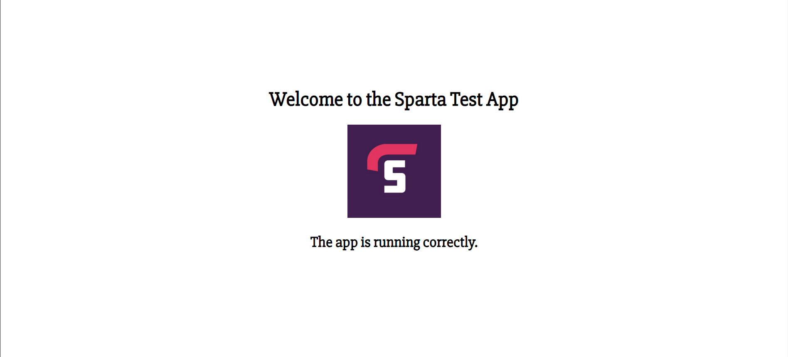

# AWS Notes

-   [AWS Notes](#aws-notes)
    -   [Deploying a web application on AWS using EC2 (with Reverse Proxy)](#deploying-a-web-application-on-aws-using-ec2-with-reverse-proxy)
        -   [Plan](#plan)
        -   [Step 1: Create an EC2 instance](#step-1-create-an-ec2-instance)
        -   [Step 2: Connect to the instance](#step-2-connect-to-the-instance)
        -   [Final steps](#final-steps)
        -   [Result](#result)
    -   [Setting up a 2-tier Deployment by adding a Database](#setting-up-a-2-tier-deployment-by-adding-a-database)
        -   [Plan](#plan-1)
        -   [Step 1: Create another EC2 instance](#step-1-create-another-ec2-instance)
        -   [Step 2: Install MongoDB on the new instance](#step-2-install-mongodb-on-the-new-instance)
        -   [Step 3: Set a DB_HOST environment variable on the app VM](#step-3-set-a-db_host-environment-variable-on-the-app-vm)
        -   [Step 4: Restart the app](#step-4-restart-the-app)
        -   [Result](#result-1)

### Deploying a web application on AWS using EC2 (with Reverse Proxy)

Elastic Compute Cloud (EC2) is a service that allows you to create virtual machine/server instances.

#### Plan

1. Create an EC2 instance
2. Connect to the instance
3. Install node, git, and nginx
4. Edit the nginx configuration file to set up a reverse proxy
5. Clone the app repository
6. Run the app

#### Step 1: Create an EC2 instance

In the AWS console, go to the EC2 dashboard and click on the "Launch Instance" button.


Choose a suitable image and instance type.


Configure the network settings to allow HTTP traffic and give the security group a name if necessary.


Check the summary to make sure everything is correct and click "Launch instance".


When the instance has been created, click the underlined instance ID to go into the instance summary.


#### Step 2: Connect to the instance

Click "Refresh" until the "Connect" button is available and then click on it.


Go to the 'SSH client' tab and copy the command to connect to the instance in a terminal.

#### Final steps

To do the final steps, you can either use the following script or run each command manually.

```bash
#!/bin/bash

sudo apt update -y

# non-interactive mode to avoid user input
sudo DEBIAN_FRONTEND=noninteractive apt-get upgrade -y

sudo apt install nginx -y

sudo sed -i "s|try_files .*;|proxy_pass http://127.0.0.1:3000;|g" /etc/nginx/sites-available/default

sudo systemctl restart nginx
sudo systemctl enable nginx

curl -fsSL https://deb.nodesource.com/setup_20.x | sudo -E bash - && sudo apt-get install -y nodejs

sudo apt install git -y

git clone https://github.com/developedbyluke/tech257-sparta-app.git repo

cd repo/app

sudo npm install

sudo npm install pm2 -g

pm2 start app.js
```

[Link to script](scripts/deploy-app.sh)

#### Result

The app should now be running and you should be able to access it by going to the public IP address of the EC2 instance in a web browser. You shouldn't need to specify the port as the reverse proxy should be working.



### Setting up a 2-tier Deployment by adding a Database

#### Plan

1. Create another EC2 instance using the same steps as before
2. Install MongoDB on the new instance
3. Set a DB_HOST environment variable on the app VM
4. Restart the app

#### Step 1: Create another EC2 instance

Follow the steps to create an EC2 instance but this time leave default settings to only allow SSH: [Create an EC2 instance](#step-1-create-an-ec2-instance)

#### Step 2: Install MongoDB on the new instance

Connect to the new instance using the steps: [Connect to the instance](#step-2-connect-to-the-instance) and then run the following script or each command manually.

```bash
#!/bin/bash

sudo apt update -y
sudo DEBIAN_FRONTEND=noninteractive apt-get upgrade -y

sudo apt-get install gnupg curl

curl -fsSL https://www.mongodb.org/static/pgp/server-7.0.asc | sudo gpg -o /usr/share/keyrings/mongodb-server-7.0.gpg --dearmor

echo "deb [ arch=amd64,arm64 signed-by=/usr/share/keyrings/mongodb-server-7.0.gpg ] https://repo.mongodb.org/apt/ubuntu jammy/mongodb-org/7.0 multiverse" | sudo tee /etc/apt/sources.list.d/mongodb-org-7.0.list

sudo apt-get update -y

sudo apt-get install -y mongodb-org=7.0.6 mongodb-org-database=7.0.6 mongodb-org-server=7.0.6 mongodb-mongosh=2.1.5 mongodb-org-mongos=7.0.6 mongodb-org-tools=7.0.6

sudo sed -i 's@127.0.0.1@0.0.0.0@' /etc/mongod.conf

sudo systemctl enable mongod
sudo systemctl start mongod
sudo systemctl status mongod
```

[Link to script](scripts/deploy-db.sh)

#### Step 3: Set a DB_HOST environment variable on the app VM

Connect to the app VM and run the following command replacing <db-private-ip> with the private IP of the database VM.

```bash
export DB_HOST="mongodb://<db-private-ip>:27017/posts"
```

#### Step 4: Restart the app

Now, restart the app and rerun npm install to seed the database (if using sudo npm install, you will need to use -E to preserve the environment variables):

```bash
pm2 kill
sudo -E npm install
pm2 start app.js
```

#### Result

You should now be able to go to the /posts page and see the list of posts.


