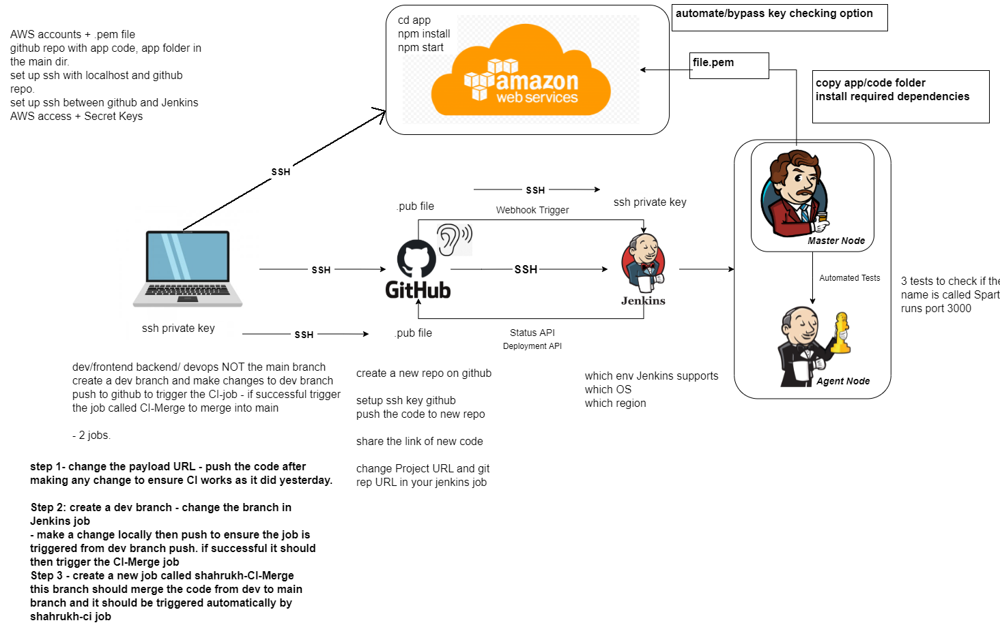
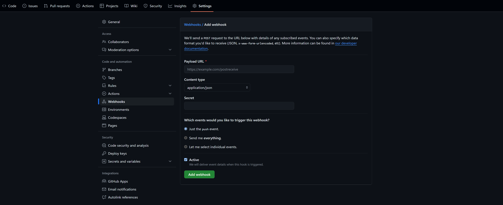

## CI/CD and Jenkins

### What is CI/CD?

CI/CD, or Continuous Integration/Continuous Delivery, is a practice in DevOps that aims to improve software development and deployment processes, mainly by making them much faster.


#### Continuous Integration (CI)

-   Developers frequently merge their code changes into a central repository.
-   Each merge triggers an automated build and testing process.
-   Provides immediate feedback to the team.
-   Can identify bugs early and save time through automation.


#### Continuous Delivery (CD)

-   Getting the updated app to users quickly and smoothly.
-   The app is always ready to be sent to users, but someone has to decide when to do it.
-   The app is sent to users automatically whenever it passes all the tests.


### Why use CI/CD?

-   To speed up the release process.
-   To catch and fix errors quickly.
-   To improve the quality of software.
-   To reduce manual work in testing and deploying software.

### When is CI/CD useful?

-   When you have a team of developers working on the same project.
-   When you want to release updates to your app quickly and smoothly.
-   When you want to make sure your app is always working correctly and passing tests.
-   When you want to reduce the time and effort spent on testing and deploying software.

### Where is CI/CD used?

-   In software development teams that want to improve their processes.
-   In companies that want to release updates to their apps quickly and automatically.

### How does CI/CD work?

Using an example of a simple CI/CD pipeline with Jenkins, GitHub, and AWS:

-   Developers write code on their computers and send it to GitHub, which stores the code online.
-   When new code is sent to GitHub, Jenkins automatically takes the code and runs tests to make sure it works.
-   If the tests pass, Jenkins can then send the updated code to AWS, which makes it available to users online.
-   If the tests fail, Jenkins lets the developers know so they can fix the problems.
-   The app is constantly being improved, tested, and made available to users, all with minimal manual work. It helps teams work together better and keeps the quality of the app high.



### Integrating GitHub Webhooks to a Jenkins Pipeline

#### Prerequisites

-   [x] Jenkins installed and available on the internet.
-   [x] Jenkins GitHub plugin installed.
-   [x] GitHub Repository

#### Create a Jenkins Job

-   Click 'New Item' on the Jenkins dashboard.
-   Enter a name for the job and select 'Freestyle project'.
-   Provide the GitHub project URL in the 'General' section.


-   In the 'Source Code Management' section, select 'Git' and provide the SSH repository URL.
-   Add the private SSH key to the credentials part.
-   Specify the branch to use.
-   In the 'Build Triggers' section, select 'GitHub hook trigger for GITScm polling'.


#### Add a GitHub Webhook

-   Go to the GitHub repository settings.
-   Click on 'Webhooks' and then 'Add webhook'.
-   Enter the Jenkins URL with '/github-webhook/' at the end, e.g. 'http://jenkins-url/github-webhook/'.
-   Select 'application/json' as the content type.
-   Make sure the webhook is active.
-   Click 'Add webhook'.



Now, whenever a change is pushed to the GitHub repository, Jenkins will automatically trigger the job.

You should see a green checkmark next to the webhook URL in the GitHub settings if it is working correctly.


### Merging with Jenkins

#### Create a new branch

```bash
git checkout -b dev
```

#### Update existing Jenkins job

-   In the 'Source Code Management' section, change the branch to 'dev'.
-   In the post-build actions, add a trigger to build another project and put the name of the job that will merge the code, e.g. merge-job.

#### Create a new Jenkins job for merging

-   Click 'New Item' on the Jenkins dashboard.
-   Enter the name of the job you put in the post-build actions of the previous job and select 'Freestyle project'.
-   In the 'Source Code Management' section, select 'Git' and provide the SSH repository URL.
-   Add the private SSH key to the credentials part.
-   Specify the dev branch.
-   In post-build actions, add a 'Git Publisher' and select 'Merge before build' and 'Push only if build succeeds'.
-   Specify the branch to merge into, e.g. 'main' and enter 'origin' in the 'Target remote name' field.
-   Save the job.

#### Test the setup

Now, whenever a change is pushed to the dev branch, the first Jenkins job will be triggered, and if it succeeds, it should trigger the second job to merge the code into the main branch.

### Deploying an app on AWS with Jenkins

#### Create an EC2 instance

Launch an EC2 instance and configure it ensuring SSH access is allowed as we will be SSHing into the instance from Jenkins.

#### Create a new Jenkins job

-   Click 'New Item' on the Jenkins dashboard.
-   Enter a name for the job and select 'Freestyle project'.
-   In the 'Source Code Management' section, select 'Git' and provide the SSH repository URL.
-   Add the private SSH key to the credentials part.
-   Specify the branch to use.
-   In the 'Build Environment' section, select 'SSH Agent' and choose the credentials with the private key that is needed to SSH into the EC2 instance.
-   In the 'Build' section, add an 'Execute shell' build step.
-   Enter the commands to SSH into the EC2 instance.
    -   Use the `-o "StrictHostKeyChecking=no"` option to avoid the prompt for adding the host to known hosts.
    -   Update the instance with the latest packages and install Nginx.
    -   Add a reverse proxy to the Nginx configuration to forward traffic to the app running on port 3000.
    -   Restart and enable Nginx.
    -   Install software needed to run the app.
    -   CD into the app folder and install the dependencies.

```bash
rsync -avz -e "ssh -o StrictHostKeyChecking=no" app ubuntu@<ec2-public-ip>:/home/ubuntu/
rsync -avz -e "ssh -o StrictHostKeyChecking=no" environment ubuntu@<ec2-public-ip>:/home/ubuntu/

ssh -o "StrictHostKeyChecking=no" ubuntu@<ec2-public-ip> <<EOF
    sudo apt-get update -y
    sudo apt-get upgrade -y

    sudo apt-get install nginx -y

    sudo systemctl restart nginx
    sudo systemctl enable nginx

    cd environment/app
    chmod +x provision.sh
    ./provision.sh

    cd ~/app
    npm install
EOF
```

### Integrating CD into the rest of the pipeline

Following on from the previous section, we can trigger the deployment job after the merge job is successful.

This will enable us to automatically deploy the app to AWS whenever we make a change to the code and push it to the dev branch.

-   In the post-build actions of the merge job, add a trigger to build another project and put the name of the job that will deploy the app, e.g. cd-job.

#### Test the setup

-   Make a change to the code and push it to the dev branch.
-   Wait for the Jenkins merge job to run and merge the code into the main branch.
-   Wait for the Jenkins deploy job to run and deploy the app to AWS.
-   Go to the EC2 instance public IP address in a browser and check if the app is running with the latest changes.

### Implementing Automated Deployment with Jenkins

Once the three jobs from the previous sections are set up, we can automate the entire process by chaining them together and finishing it off with a final job that will start the app on our EC2 instance.

This will enable us to simply push code changes to the dev branch and have Jenkins take care of the rest, from merging the code to deploying it to AWS and starting the app, so we can see our changes live without any manual work.

#### Create a new Jenkins job

-   Click 'New Item' on the Jenkins dashboard.
-   Enter a name for the job and select 'Freestyle project'.
-   In the 'Build Environment' section, select 'SSH Agent' and choose the credentials with the private key that is needed to SSH into the EC2 instance.
-   In the 'Build' section, add an 'Execute shell' build step.
-   Enter the commands to SSH into the EC2 instance and start the app.

```bash
ssh -o "StrictHostKeyChecking=no" ubuntu@54.154.166.106 <<EOF
	# kill process listening on port 3000
	kill -9 $(lsof -i:3000 -t) 2> /dev/null
    cd app
    npm install
    nohup node app.js > /dev/null 2>81 &
EOF
```

#### Test the setup

-   Make a change to the code and push it to the dev branch.
-   Wait for the four Jenkins jobs to run and then go to the EC2 instance public IP address in a browser and check if the app is running with the latest changes.

### Building Jenkins on an EC2 instance

#### Create EC2 instance

-   Launch an EC2 instance with:
    -   Ubuntu
    -   Instance type: t2.micro
    -   Security group: allow SSH, HTTP, and open port 8080 in the inbound rules

#### SSH into the instance

```bash
ssh -i <private-key> ubuntu@<ec2-public-ip>
```

#### Install Java

```bash
sudo apt update
sudo apt install openjdk-8-jdk -y
```

#### Install Jenkins

https://www.jenkins.io/doc/book/installing/linux/#debianubuntu

```bash
sudo wget -O /usr/share/keyrings/jenkins-keyring.asc \
  https://pkg.jenkins.io/debian-stable/jenkins.io-2023.key
echo deb [signed-by=/usr/share/keyrings/jenkins-keyring.asc] \
  https://pkg.jenkins.io/debian-stable binary/ | sudo tee \
  /etc/apt/sources.list.d/jenkins.list > /dev/null
sudo apt-get update
sudo apt-get install jenkins
```

#### Start and Enable Jenkins

```bash
sudo systemctl start jenkins
sudo systemctl enable jenkins
```

#### Setup Jenkins

https://www.jenkins.io/doc/book/installing/linux/#unlocking-jenkins

-   Go to `http://<ec2-public-ip>:8080` in a browser.
-   Enter the initial admin password from `/var/lib/jenkins/secrets/initialAdminPassword` by using the command `sudo nano <path>` to read it.
-   Install suggested plugins.
-   Create an admin user.
-   Save and finish the setup.

#### Install SSH Agent Plugin

This plugin is needed to SSH into other servers in Jenkins jobs.

-   Go to 'Manage Jenkins' > 'Manage Plugins'.
-   Click on the 'Available' tab and search for 'SSH Agent'.
-   Install the plugin and restart Jenkins.
