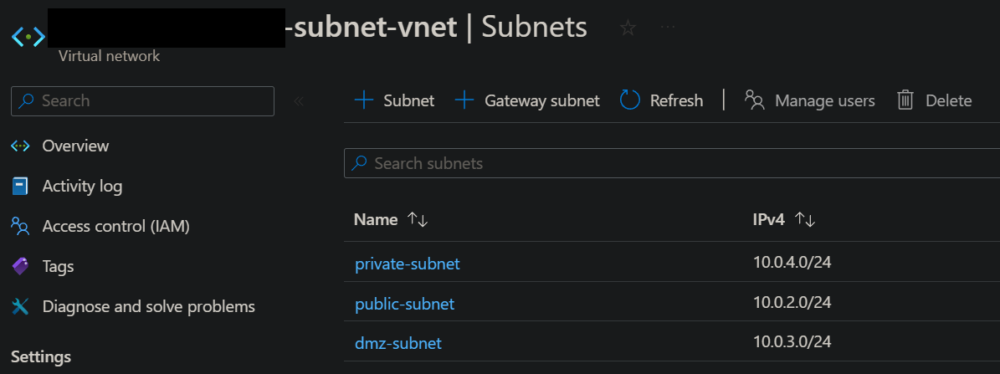
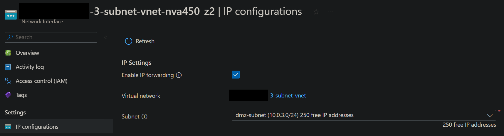
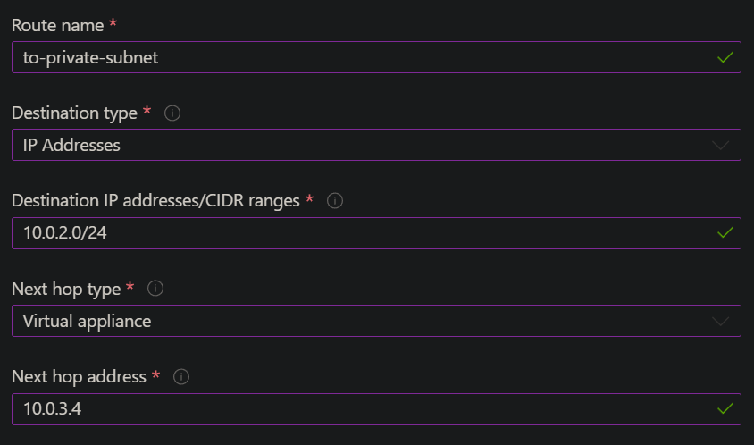

# Using an NVA in a 3 Subnet Architecture for a Private Database VM

### Pre-requisites

-   [x] A virtual network with three subnets: public, private, and DMZ



-   [x] A virtual machine for the database
-   [x] A virtual machine running the application

### Steps

#### If they are not already linked, connect the app VM to the database VM

Set a DB_HOST environment variable on the app VM with the database's private IP address and the MongoDB default port number.

```bash
export DB_HOST="mongodb://10.0.4.4:27017/posts"
```

#### Create a Network Virtual Appliance (NVA)

Create a new virtual machine that uses the DMZ subnet with the SSH inbound port open.

#### Enable IP forwarding on the NVA

To route traffic through the NVA, turn on IP forwarding in Azure and in the operating system of vm-nva. When IP forwarding is enabled, any traffic received by vm-nva that's destined for a different IP address, isn't dropped and is forwarded to the correct destination.

1. In the Azure portal, go to the NVA's Network Interface resource and check the box to enable IP forwarding.



1. SSH into the NVA and enable IP forwarding.

```bash
sudo nano /etc/sysctl.conf # Open the sysctl.conf file
```

Uncomment the line `net.ipv4.ip_forward=1` and save the file.

```bash
sudo sysctl -p # Apply the changes
```

#### Set up a route table

The route table defines the route that traffic takes through the NVA. It's associated with the subnet that contains the source of the traffic, in this case, the app VM.

1. In the search box at the top of the portal, enter Route table. Select Route tables in the search results and create one.
2. Select 'Routes' from the side menu.
3. Click 'Add'.
4. Enter the following settings.



5. Go to 'Subnets' in the side menu.
6. Click 'Associate'.
7. Select the virtual network and the public subnet.

#### Set up iptables on the NVA

iptables is a utility program that allows you to configure the IP packet filter rules of the Linux kernel firewall.

In our case, this is useful for specifying the virtual machine we want to be able to connect to the database VM. We could then deny all other traffic to achieve a very secure network.

```bash
#!/bin/bash

# configure iptables

echo "Configuring iptables..."

# ADD COMMENT ABOUT WHAT THE FOLLOWING COMMAND(S) DO
sudo iptables -A INPUT -i lo -j ACCEPT
sudo iptables -A OUTPUT -o lo -j ACCEPT

# ADD COMMENT ABOUT WHAT THE FOLLOWING COMMAND(S) DO
sudo iptables -A INPUT -m state --state ESTABLISHED,RELATED -j ACCEPT

# ADD COMMENT ABOUT WHAT THE FOLLOWING COMMAND(S) DO
sudo iptables -A OUTPUT -m state --state ESTABLISHED -j ACCEPT

# ADD COMMENT ABOUT WHAT THE FOLLOWING COMMAND(S) DO
sudo iptables -A INPUT -m state --state INVALID -j DROP

# ADD COMMENT ABOUT WHAT THE FOLLOWING COMMAND(S) DO
sudo iptables -A INPUT -p tcp --dport 22 -m state --state NEW,ESTABLISHED -j ACCEPT
sudo iptables -A OUTPUT -p tcp --sport 22 -m state --state ESTABLISHED -j ACCEPT

# uncomment the following lines if want allow SSH into NVA only through the public subnet (app VM as a jumpbox)
# this must be done once the NVA's public IP address is removed
#sudo iptables -A INPUT -p tcp -s 10.0.2.0/24 --dport 22 -m state --state NEW,ESTABLISHED -j ACCEPT
#sudo iptables -A OUTPUT -p tcp --sport 22 -m state --state ESTABLISHED -j ACCEPT

# uncomment the following lines if want allow SSH to other servers using the NVA as a jumpbox
# if need to make outgoing SSH connections with other servers from NVA
#sudo iptables -A OUTPUT -p tcp --dport 22 -m conntrack --ctstate NEW,ESTABLISHED -j ACCEPT
#sudo iptables -A INPUT -p tcp --sport 22 -m conntrack --ctstate ESTABLISHED -j ACCEPT

# ADD COMMENT ABOUT WHAT THE FOLLOWING COMMAND(S) DO
sudo iptables -A FORWARD -p tcp -s 10.0.2.0/24 -d 10.0.4.0/24 --destination-port 27017 -m tcp -j ACCEPT

# ADD COMMENT ABOUT WHAT THE FOLLOWING COMMAND(S) DO
sudo iptables -A FORWARD -p icmp -s 10.0.2.0/24 -d 10.0.4.0/24 -m state --state NEW,ESTABLISHED -j ACCEPT

# ADD COMMENT ABOUT WHAT THE FOLLOWING COMMAND(S) DO
sudo iptables -P INPUT DROP

# ADD COMMENT ABOUT WHAT THE FOLLOWING COMMAND(S) DO
sudo iptables -P FORWARD DROP

echo "Done!"
echo ""

# make iptables rules persistent
# it will ask for user input by default

echo "Make iptables rules persistent..."
sudo DEBIAN_FRONTEND=noninteractive apt install iptables-persistent -y
echo "Done!"
echo ""
```

#### Test the connection

SSH into the app VM and ping the database VM to check connectivity.

```bash
ping 10.0.4.4
```
