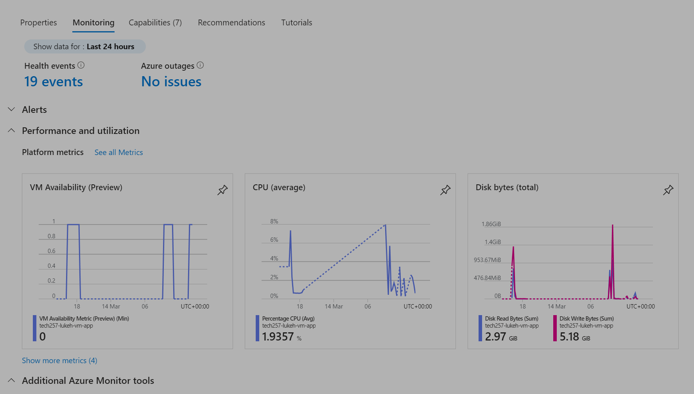
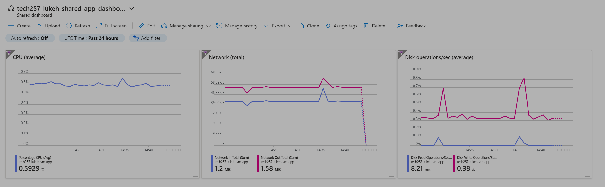
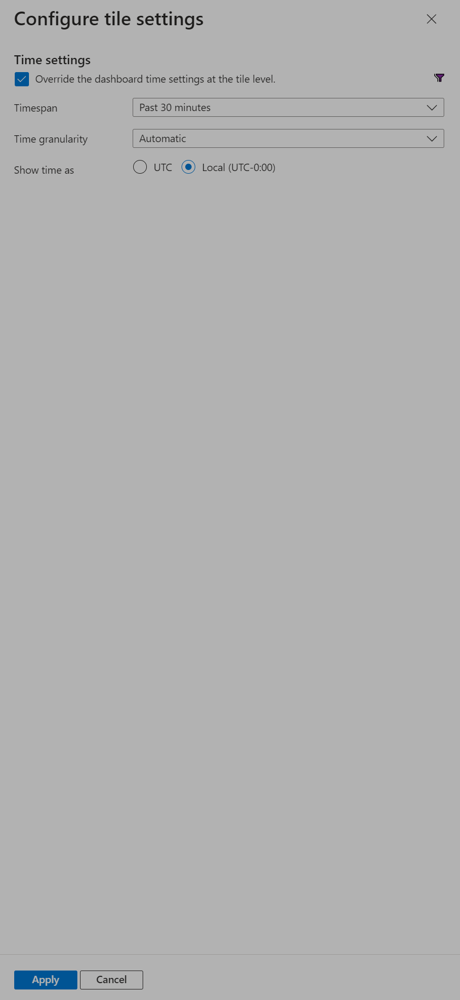
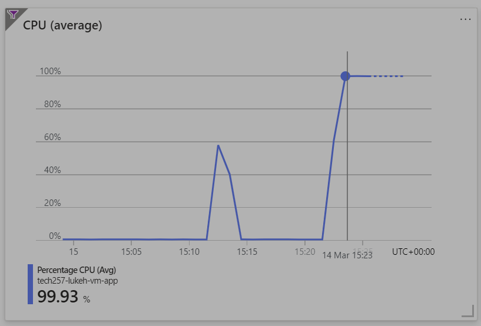
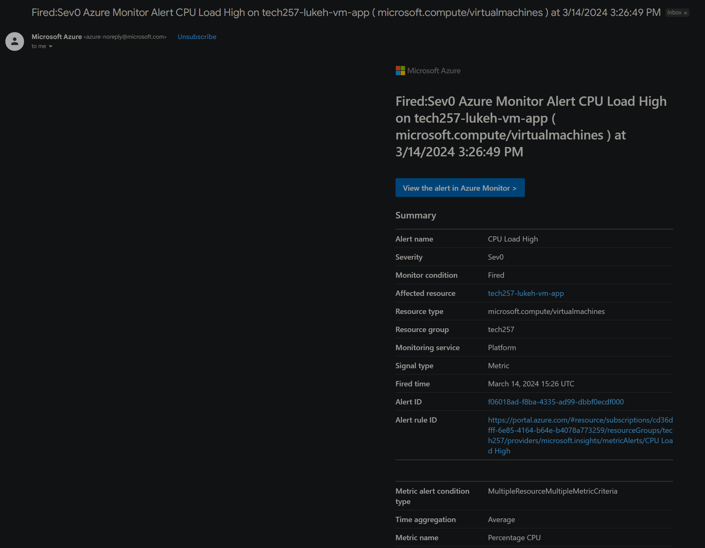

# Autoscaling in Azure

### Comparing scaling methods

#### Worst: Fully Manual Monitoring

-   **Description** : A team constantly watches CPU load on a dashboard and manually creates or deletes VMs based on observed demand. This method is highly inefficient, prone to human error, resource-intensive, and is not scalable.

#### Better: Alert-Based Monitoring

-   **Description** : The system is slightly improved by setting up alerts that notify the team when CPU load breaches specific thresholds. The team then manually intervenes to adjust resources. This reduces the need for constant monitoring but still requires manual intervention which can be slow and error-prone.

#### Best: Autoscaling

-   **Description** : Introduces automation by using autoscaling features that automatically add or remove VMs based on predefined CPU load thresholds. This provides a faster response to load changes and reduces manual work.

### Setting Up a Dashboard in Azure for a VM

**Create a Dashboard**

Within a VM's 'Overview' panel, go to the 'Monitoring' tab and pin the metrics you want to monitor to a new or existing dashboard.

**Go to the Dashboard** :

-   Search for "Dashboards" in the Azure Portal and click on "Dashboard Hub" from the results or navigate there another way.
-   Click into your dashboard.

**Configure the Metrics** :

-   Right click on a tile and click 'Configure tile settings'.
-   Adjust the timespan and granularity as needed.

**Save the Dashboard** : Once you have configured a tile, click "Save to Dashboard".

### How Combining Load Testing with Azure Dashboard Helped

-   **Preparation** : Conducting load testing to simulate increased traffic helped to identify potential bottlenecks or failures.
-   **Analysis and Adjustment** : Analysing the dashboard tiles allowed informed decisions on resource allocation.

### CPU Load Testing with CPU Usage Alerts

To set up a CPU usage alert:

-   Go to the VM and click 'Alerts' in the side menu.
-   Click to create a new alert rule.
-   Select the CPU usage metric.
-   Set the CPU usage threshold for the alert.
-   Create an action group to send an email or other notification.
-   Specify the email to send the alert to in the 'Email' field.
-   Create the alert rule.
-   Test the alert by simulating high CPU load.
-   Check for email notifications.

After setting up a CPU usage email alert and conducting some heavy load testing, the CPU load reaches 100% and I receive an email.

