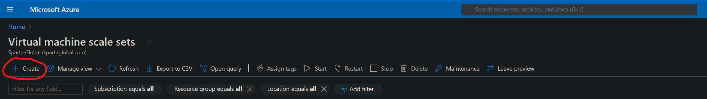
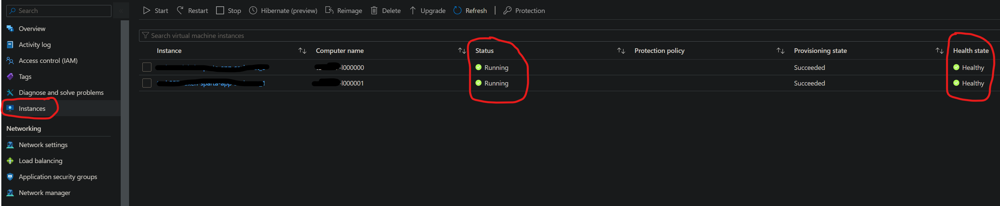

# Scale Sets in Azure

-   [Scale Sets in Azure](#scale-sets-in-azure)
    -   [What is a Scale Set?](#what-is-a-scale-set)
    -   [What is a Load Balancer?](#what-is-a-load-balancer)
    -   [Pre-Requisites to Make a Scale Set](#pre-requisites-to-make-a-scale-set)
    -   [How to Make a Scale Set](#how-to-make-a-scale-set)
    -   [How to Test the Scale Set](#how-to-test-the-scale-set)
    -   [Healthy/Unhealthy Health State](#healthyunhealthy-health-state)
        -   [Making an Instance Unhealthy](#making-an-instance-unhealthy)
    -   [How to SSH into a Virtual Machine Instance](#how-to-ssh-into-a-virtual-machine-instance)
    -   [Deleting a Scale Set and all of its Connected Resources](#deleting-a-scale-set-and-all-of-its-connected-resources)

### What is a Scale Set?

A scale set is a group of virtual machine instances that are created from the same image and are managed as a group.

Scale sets can automatically increase or decrease the number of instances based on autoscaling conditions, such as CPU usage thresholds.


### What is a Load Balancer?

A load balancer is a service that distributes inbound traffic across available virtual machine instances.

This ensures that no single virtual machine instance is overwhelmed with traffic and that the load is distributed evenly across all instances.

If a virtual machine instance fails, the load balancer will stop sending traffic to that instance and redirect inbound traffic to the remaining available instances.

### Pre-Requisites to Make a Scale Set

-   [x] Have a virtual machine image in Azure to use for the virtual machine instances in the scale set.

### How to Make a Scale Set

1. Go to the 'Virtual machine scale sets' page in the Azure portal.
2. Click 'Create'.



3. Configure your scale set making sure to select the image you want to use for the virtual machine instances.


4. In the 'Networking' tab, choose or create a load balancer to use with the scale set.


5. Enable application health monitoring and choose a grace period for the virtual machine instances.


6. In the 'Advanced' tab, add any user data the virtual machine instances will need. In this case, I am adding a simple script to start the app.


7. Go to 'Review + create' and click 'Create' once you have reviewed the settings.


### How to Test the Scale Set

-   [x] Virtual machine instances are running and healthy.
-   [x] You can access the app you have running in a web browser.

1. Go to your new scale set in the Azure portal and click 'Instances'.
2. Check if the virtual machine instances are running and healthy.



3. If they are, you should be able to access the app you have running on the virtual machine instances by going to the public IP address of the load balancer in a web browser.


### Healthy/Unhealthy Health State

The virtual machine instances in the scale set will be marked as healthy if the health probe receives a response with a status code of 200 from the virtual machine instance. If the health probe receives a response with a status code other than 200, the virtual machine instance will be marked as unhealthy.

#### Making an Instance Unhealthy

To make a virtual machine instance unhealthy, you can stop the app running on that virtual machine by restarting the instance. Since we are using user data to start the app, the app will not start when the virtual machine instance is restarted because the user data is only run when the virtual machine instance is created.

1. Go to an instance and click 'Restart'.


2. Once the virtual machine instance has restarted, you should see an 'Unhealthy' health state for that instance in your list of instances.


To make the scale set instances healthy again, you can click 'Reimage' on the scale set and the virtual machine instances will be recreated.


### How to SSH into a Virtual Machine Instance

To connect to an instance via SSH, you will need to use the public IP address of the load balancer and the SSH key you used to create the scale set.

You will also need to specify a port number using `-p xxxx` depending on the instance you want to connect to.

The starting port number is 50000 and the port number increases by 1 for each instance in the scale set, so to connect to the first instance you would use port 50000, and 50001 for the second.

```bash
# Connect to the first instance in the scale set
ssh -i ~/.ssh/private-key -p 50000 username@load-balancer-public-ip
```

### Deleting a Scale Set and all of its Connected Resources

If you know the names used for the resources in the scale set, you can delete them in the resource group by selecting the resources and clicking 'Delete'.


