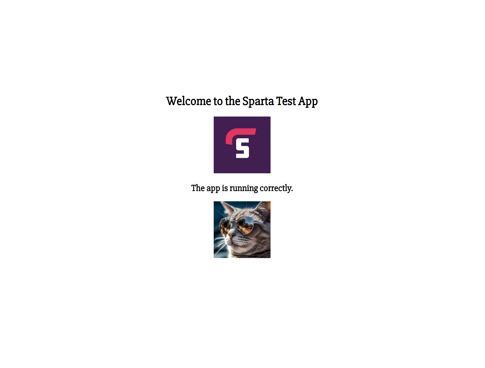

#### Script:

```bash
#!/bin/bash

echo "creating storage account..."
az storage account create --name tech257lukestorage --resource-group tech257 --location uksouth --sku Standard_LRS

echo "allowing blob public access..."
az storage account update --name tech257lukestorage --resource-group tech257 --allow-blob-public-access true

echo "creating container..."
az storage container create --account-name tech257lukestorage --name images --public-access blob --auth-mode login

echo "downloading image..."
sudo curl -o cat.png https://cdn.pixabay.com/photo/2023/07/03/05/22/ai-generated-8103382_1280.jpg

echo "uploading blob..."
az storage blob upload --account-name tech257lukestorage --container-name images --name cat --file /repo/app/cat.png --auth-mode login

sudo rm cat.png

blobUrl=$(az storage blob url --account-name tech257lukestorage --container-name images --name cat --auth-mode login --output tsv)

echo "blob URL: $blobUrl"

cd views
search="The app is running correctly"
insert=""

file="index.ejs"
if ! grep -Fq "$insert" "$file"; then
    sudo sed -i "/$search/a $insert" "$file"
fi

cd ..

echo "starting app..."
pm2 stop app
pm2 start app.js
```


